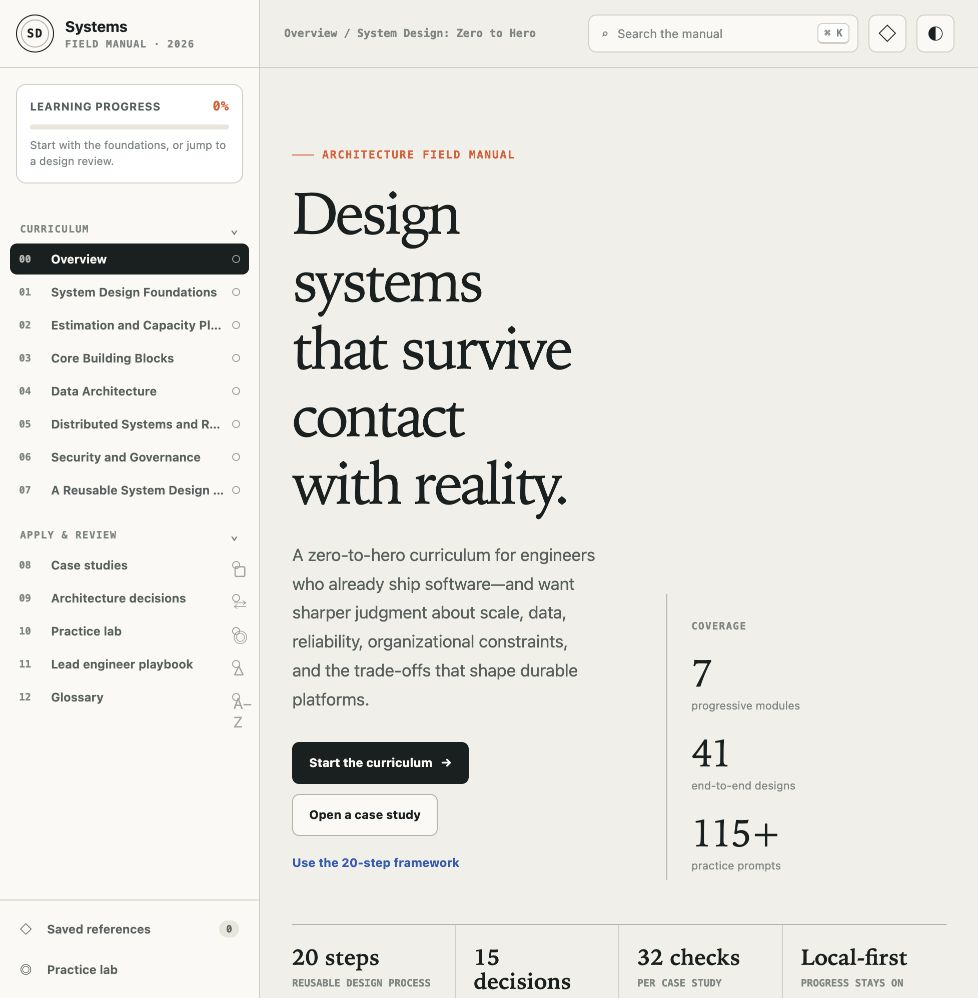

# System Design: Zero to Hero

A local-first system design learning platform for senior and lead software engineers. The standalone application uses plain HTML, CSS, and JavaScript; it has no backend, account, database, build requirement, or remote runtime dependency.



## Run locally

### Fastest option

Open `index.html` directly in a modern browser. Search, navigation, diagrams, quizzes, theme selection, bookmarks, and progress tracking work from the local file.

### Local development preview

The included preview wrapper is optional:

```bash
npm install
npm run static:sync
npm run dev
```

Open the local URL printed by the development server. The wrapper displays the same standalone manual from `public/manual/`.

### Production build

```bash
npm run build
```

The prebuild step synchronizes the standalone source into the hosted preview automatically.

## Source structure

```text
.
├── index.html                 # Standalone entry point
├── styles.css                # Responsive visual system
├── app.js                    # Router, rendering, search, progress, quizzes
├── content/
│   ├── modules-foundations.js
│   ├── modules-advanced.js
│   ├── framework-tradeoffs.js
│   ├── cases-ecommerce.js
│   ├── cases-general.js
│   └── assessments.js
├── app/                       # Optional hosted preview wrapper
├── scripts/sync-static.mjs   # Copies standalone source into public/manual
└── tests/                     # Content and rendered-site validation
```

## Learning platform features

- Seven progressive modules from design fundamentals through a reusable 20-step framework
- Forty-one production-shaped system design case studies, including seventeen e-commerce systems
- Thirty-two explicit review areas in every case study
- Architecture and sequence diagrams rendered with static HTML and CSS
- Fifteen architecture decision comparisons
- Search, topic filters, accordions, tabs, quizzes, timers, and evaluation rubrics
- Local bookmarks, completion state, last page, and light/dark preference via browser storage
- Responsive desktop and tablet navigation, keyboard focus support, reduced-motion support, and print styles

## Local data and privacy

The site writes only four preference keys to browser storage: theme, completed pages, bookmarks, and the last-opened route. It does not transmit data or load third-party scripts, fonts, analytics, or services.
